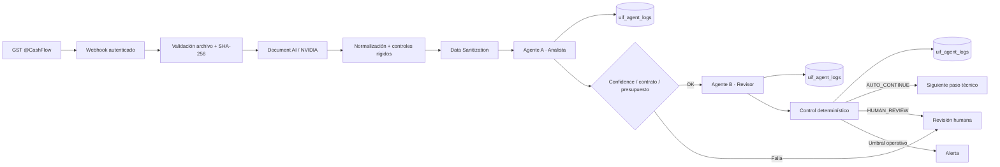

# Arquitectura · UIF Production-Ready

## Patrón de orquestación

Se usa **Handoff controlado**: el Agente A analiza integridad y, solo si supera el gate de contrato/confianza/coste, entrega el caso al Agente B. No hay bucles reflexivos ni agentes llamándose indefinidamente.

## Por qué este patrón

El proceso UIF exige trazabilidad y límites de autoridad. Por eso la IA no puede sobreescribir reglas determinísticas ni tomar decisiones regulatorias. El control final siempre valida los outputs de los agentes y aplica fallback a revisión humana.

## Fronteras de datos

- **Document AI:** procesa el documento necesario para extracción.
- **Capa de agentes:** recibe únicamente datos sanitizados.
- **Logs:** no contienen PII ni texto documental.
- **Repositorio:** no contiene PDFs reales ni secretos.
